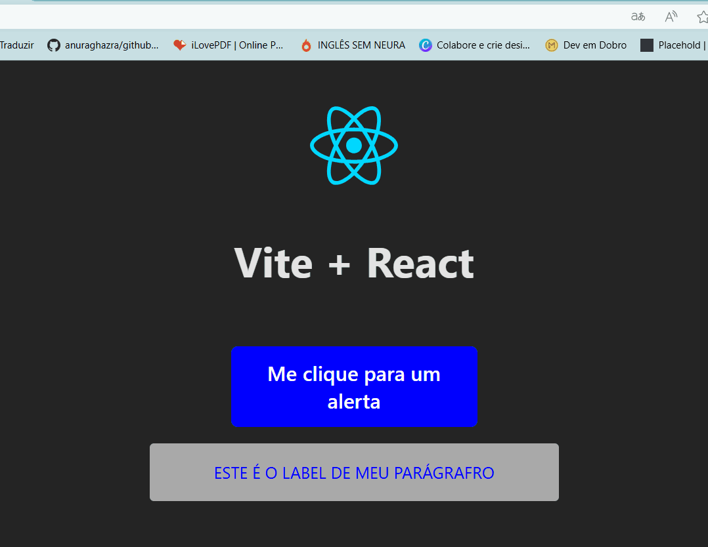

# Projeto React BASE

## Este projeto é uma prática do que foi aprendido durente o Módulo, apresenta dois componentes, o StyledP e ButtonAlert. O componente StyledP renderiza um P estilizado através de props e do método .toUpperCase() e o ButtonAlert exibe um alerta com as informções da prop label do botão. 
