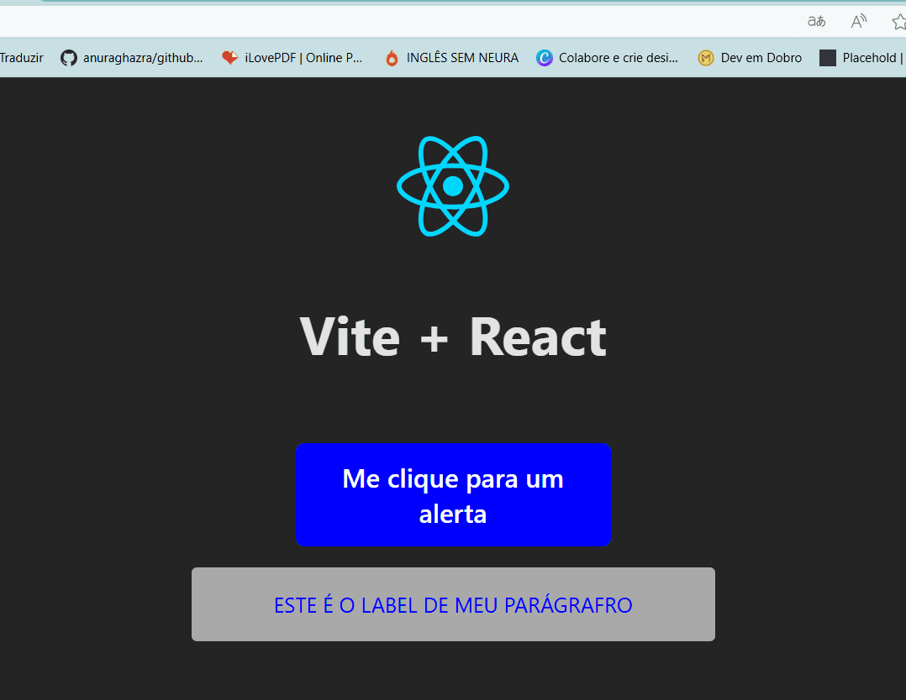

# Projeto React BASE

## Descrição

Este projeto é uma prática do que foi aprendido durante o módulo de React. Ele contém dois componentes principais: **StyledP** e **ButtonAlert**. 

- O componente **StyledP** é responsável por renderizar um parágrafo (`
`) estilizado, utilizando propriedades (props) e aplicando o método `.toUpperCase()` ao seu conteúdo para garantir que o texto seja exibido em letras maiúsculas.
  
- O componente **ButtonAlert** exibe um alerta (`alert`) ao ser clicado, mostrando as informações passadas pela propriedade `label` do botão.
